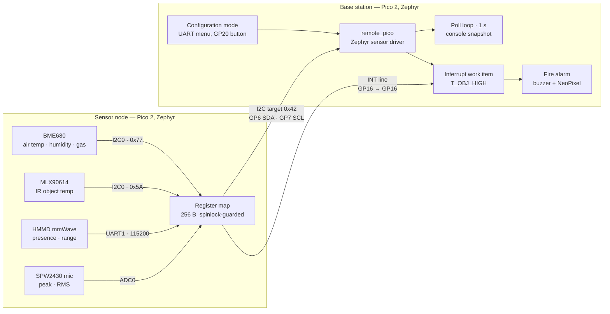

# Embedded Fire Detection and Room Occupancy Monitoring System

A two-board embedded system built on **Zephyr RTOS 4.2.1** and the **Raspberry Pi Pico 2 (RP2350A, Cortex-M33)**.
A *sensor node* fuses four sensors (air quality, infrared object temperature, mmWave presence, and a microphone)
into a byte-addressable register map and serves it as an **I2C target device** with a hardware interrupt line.
A *base station* reads that register map through a custom Zephyr sensor driver, drives a buzzer and NeoPixel
alarm on an object-temperature interrupt, and exposes an interactive UART configuration menu.

This repository is a personal fork of the original team project,
[pes-project-group4/embedded-fire-occupancy](https://github.com/pes-project-group4/embedded-fire-occupancy),
with the full upstream commit history preserved. See [Team and attribution](#team-and-attribution).

> **Status:** prototype firmware from a completed group project. Both applications cross-compile cleanly (see [Verification](#verification)),
> but no automated tests or hardware measurement logs exist in the repository, and the maintainer of this fork does not
> currently have access to the hardware. Known defects are listed honestly in [Known issues](#known-issues-and-limitations).

---

## Contents

- [System architecture](#system-architecture)
- [Hardware and wiring](#hardware-and-wiring)
- [Firmware behaviour](#firmware-behaviour)
- [Register interface](#register-interface)
- [Repository layout](#repository-layout)
- [Building and flashing](#building-and-flashing)
- [Verification](#verification)
- [Known issues and limitations](#known-issues-and-limitations)
- [Report-versus-source discrepancies](#report-versus-source-discrepancies)
- [Team and attribution](#team-and-attribution)

---

## System architecture



**Data path.** Each sensor on the node is sampled by its own Zephyr thread and published into a 256-byte register
map. The base station burst-reads the first 76 bytes of that map once per second and decodes them through the
standard Zephyr `sensor_channel_get()` API. When the node's object temperature rises above a base-station-configured
threshold, the node latches an interrupt source bit and asserts its INT pin; the base station's GPIO callback fetches
the map, triggers the alarm, and clears the interrupt over I2C.

---

## Hardware and wiring

Pin assignments below are taken directly from the devicetree overlays, not from external documentation.

### Sensor node ([`sensor_node/boards/rpi_pico2_rp2350a_m33.overlay`](sensor_node/boards/rpi_pico2_rp2350a_m33.overlay))

| Peripheral | Bus / pins | Role |
|---|---|---|
| BME680 (temperature, humidity, gas) | I2C0 · GP4 SDA · GP5 SCL · 100 kHz · address `0x77` | Controller-side sensor |
| MLX90614 (infrared object / ambient temperature) | I2C0 · GP4 SDA · GP5 SCL · address `0x5A` (SMBus with PEC) | Controller-side sensor |
| HMMD mmWave radar | UART1 · GP8 TX · GP9 RX · 115200 8N1 | Presence / range, ASCII output mode |
| SPW2430 microphone | ADC channel 0 (GP26) · 12-bit · 3.3 V reference | Sound level (peak, RMS) |
| Base-station link | I2C1 · GP6 SDA · GP7 SCL · **target address `0x42`** | Register map server |
| Interrupt output | GP16 · active-high | Asserted while any interrupt source is pending |
| Console | UART0 (board default) | Debug log |

### Base station ([`base_station/boards/rpi_pico2_rp2350a_m33.overlay`](base_station/boards/rpi_pico2_rp2350a_m33.overlay))

| Peripheral | Bus / pins | Role |
|---|---|---|
| Sensor-node link | I2C1 · GP6 SDA · GP7 SCL · 100 kHz · controller | Reads/writes the register map |
| Interrupt input | GP16 · pull-down · edge-to-active | From sensor node INT |
| Mode button | GP20 · pull-up · active-low | Toggles normal / configuration mode |
| Buzzer | GP18 · GPIO output, software-toggled tone | Alarm audio, 500–1500 Hz sweep |
| NeoPixel (WS2812, 1 pixel) | GP28 via PIO0 | Alarm visual, red flash when room occupied |
| Console | UART0 (board default) | Sensor snapshot and configuration menu |

Connect the two boards with **GP6↔GP6, GP7↔GP7, GP16↔GP16, and common ground**. Pull-ups on the I2C link are
enabled in both overlays.

---

## Firmware behaviour

### Sensor node ([`sensor_node/`](sensor_node))

| Thread | Period | Source | Publishes |
|---|---|---|---|
| `bme680` | 2000 ms | [`bme680.c`](sensor_node/src/sensors/bme680/bme680.c) — forced-mode measurement with integer compensation | air temp (centi-°C), humidity (milli-%RH), gas resistance (Ω), gas-valid flag |
| `mlx90614` | 500 ms | [`mlx90614.c`](sensor_node/src/sensors/mlx90614/mlx90614.c) — SMBus word reads with CRC-8 PEC check | ambient and object temp (centi-°C) |
| `mmwave` | 500 ms | [`mmwave.c`](sensor_node/src/sensors/mmwave/mmwave.c) — interrupt-driven UART, ring buffer, `ON` / `OFF` / `Range N` line parser | presence, range (cm); applies gate / absence-delay config |
| `mic` | 250 ms | [`spw2430.c`](sensor_node/src/sensors/spw2430/spw2430.c) — 64-sample ADC window against a 500-sample boot baseline | peak and RMS deviation (ADC counts) |
| `irq` | 20 ms | [`main.c`](sensor_node/src/main.c) | mirrors `INT_SRC != 0` onto the GP16 output |

- A shared mutex serialises the two I2C0 sensor drivers; the register map itself is protected by a spinlock
  ([`register_map.c`](sensor_node/src/registers/register_map.c)).
- Sensors whose initialisation fails are cleared from the `CTRL` enable mask and their threads are not started, so
  the node still serves whatever data it has.
- The I2C target implementation ([`i2c_target.c`](sensor_node/src/i2c/i2c_target.c)) follows the conventional
  *register-pointer* model: the first byte of a write sets the pointer, subsequent bytes write consecutive registers,
  and reads return consecutive registers from the pointer.

### Base station ([`base_station/`](base_station))

- [`remote_pico.c`](base_station/drivers/sensor/remote_pico/remote_pico.c) is an out-of-tree Zephyr sensor driver
  (`compatible = "vnd,remote-pico"`, binding in [`dts/bindings/sensor/`](base_station/dts/bindings/sensor/vnd,remote-pico.yaml)).
  `sample_fetch` performs one 76-byte burst read; `channel_get` decodes standard channels (`AMBIENT_TEMP`, `HUMIDITY`,
  `GAS_RES`) plus private channels for object temperature, range, occupancy, microphone and interrupt source.
- [`main.c`](base_station/src/main.c) polls every second, prints a one-line snapshot, and clears the alarm once the
  object temperature is back at or below the threshold.
- [`remote_pico_interrupts.c`](base_station/src/remote_pico_interrupts.c) configures the node at start-up
  (disable interrupts → write threshold → clear `INT_SRC` → enable `T_OBJ_HIGH`), retrying every 2 s until the node
  answers, and services the GP16 edge in a system-workqueue item.
- [`fire_alarm.c`](base_station/src/fire_alarm.c) runs a dedicated thread that sweeps the buzzer between 500 and
  1500 Hz and flashes the NeoPixel red at 1 Hz when the room was occupied at trigger time.
- [`config_mode.c`](base_station/src/config_mode.c) is a blocking UART menu entered with the GP20 button:
  fire threshold in °C (e.g. `30` or `30.50`), mmWave maximum range gate (0–15, ≈70 cm per gate) and absence delay
  (0–65535 s). Default threshold is **30.00 °C**.

---

## Register interface

Authoritative definitions: [`register_map.h`](sensor_node/src/registers/register_map.h) (node) and the matching
constants in [`remote_pico.c`](base_station/drivers/sensor/remote_pico/remote_pico.c) (base station).
All multi-byte fields are **little-endian**. Unlisted addresses read as zero and ignore writes.

| Addr | Name | Type | Access | Meaning |
|---|---|---|---|---|
| `0x00` | `STATUS` | u8 | R | bit 0 `DATA_READY`, bit 1 `IRQ_PENDING` |
| `0x01` | `CTRL` | u8 | R/W | sensor enable bits: 0 BME680, 1 MLX90614, 2 mmWave, 3 mic |
| `0x02` | `INT_SRC` | u8 | R/W | bit 2 `T_OBJ_HIGH`; write `0` to clear |
| `0x03` | `INT_EN` | u8 | R/W | bit 2 enables `T_OBJ_HIGH` |
| `0x10` | `BME_TEMP` | i32 | R | air temperature, centi-°C |
| `0x14` | `BME_HUM` | u32 | R | relative humidity, milli-% |
| `0x18` | `BME_GAS` | u32 | R | gas resistance, Ω |
| `0x1C` | `BME_GAS_VALID` | u8 | R | 1 when the gas reading is flagged valid |
| `0x20` | `MLX_AMB` | i32 | R | ambient temperature, centi-°C |
| `0x24` | `MLX_OBJ` | i32 | R | object temperature, centi-°C |
| `0x30` | `MMW_RANGE` | u16 | R | target range, cm |
| `0x32` | `MMW_PRESENT` | u8 | R | 1 when presence detected within the last 2 s |
| `0x33` | `MMW_MAX_GATE` | u8 | R/W | radar range gate 0–15 (default 5) |
| `0x34` | `MMW_ABSENCE` | u16 | R/W | radar absence delay, s (default 5) |
| `0x40` | `MIC_PEAK` | i32 | R | peak deviation from baseline, ADC counts |
| `0x44` | `MIC_RMS` | i32 | R | RMS deviation, ADC counts |
| `0x48` | `MIC_BASELINE` | i32 | R | boot-time baseline, ADC counts |
| `0x68` | `T_OBJ_HIGH` | i32 | R/W | alarm threshold, centi-°C; `INT32_MAX` = disabled (default) |
| `0xFF` | `CHIP_ID` | u8 | R | `0x42` |

**Transactions.** Read: write `[reg]`, repeated start, read *N* bytes (pointer auto-increments).
Write: `[reg, d0, d1, …]`. The base station reads `0x00–0x4B` in one burst per poll.

**Interrupt semantics.** `T_OBJ_HIGH` is *edge-triggered*: it is raised on the sample where `MLX_OBJ > T_OBJ_HIGH`
first becomes true, provided the bit is enabled in `INT_EN`. The INT pin stays high until the controller writes `0` to
`INT_SRC`. Writes to `INT_SRC` / `INT_EN` are masked to the defined bit.

---

## Repository layout

```
.
├── west.yml                      # Zephyr v4.2.1 manifest (imports Zephyr's module list)
├── .github/workflows/
│   ├── ci.yml                    # builds both apps for rpi_pico2/rp2350a/m33 on push / PR
│   └── release.yml               # builds and attaches .uf2/.elf/.hex/.bin to GitHub Releases
├── sensor_node/                  # Zephyr app: sensors → register map → I2C target
│   ├── boards/…overlay           # pinmux, I2C0/I2C1, UART1, ADC, INT output
│   └── src/
│       ├── main.c                # thread setup, enable mask, IRQ pump
│       ├── i2c/                  # I2C target callbacks (register-pointer model)
│       ├── registers/            # register map, publish helpers, interrupt latch
│       └── sensors/              # bme680, mlx90614, mmwave, spw2430
├── base_station/                 # Zephyr app: sensor driver → poll / IRQ → alarm / config
│   ├── boards/…overlay           # I2C1 controller, INT input, button, buzzer, WS2812
│   ├── drivers/sensor/remote_pico/   # out-of-tree Zephyr sensor driver + Kconfig
│   ├── dts/bindings/sensor/      # vnd,remote-pico binding
│   └── src/                      # main, config_mode, fire_alarm, interrupts, display
└── datasheets/                   # BME680, MLX90614 SMBus note, HMMD mmWave, SPW2430
```

---

## Building and flashing

### Prerequisites

- Python 3.10 or newer (CI uses 3.12), `west`, CMake ≥ 3.20, Ninja
- [Zephyr SDK](https://github.com/zephyrproject-rtos/sdk-ng/releases) 0.17.x with the `arm-zephyr-eabi` toolchain
- Git, and several GB of disk for the Zephyr tree and modules

### Workspace setup

[`west.yml`](west.yml) makes this repository the *manifest repository*; Zephyr and its modules are fetched **inside**
the checkout (`zephyr/`, `modules/`, `.west/` are git-ignored).

```bash
git clone https://github.com/Padmaja777AI/embedded-fire-occupancy.git
cd embedded-fire-occupancy

python3 -m venv .venv && source .venv/bin/activate
pip install west
west init -l .
west update                       # full module set; see the filter below for a lighter checkout
west zephyr-export
pip install -r zephyr/scripts/requirements.txt
```

Only Zephyr, the RP2 HAL and CMSIS are needed for these boards. To avoid downloading every module:

```bash
west config manifest.project-filter -- "-.*,+zephyr,+hal_rpi_pico,+cmsis_6,+cmsis"
west update
```

### Build

```bash
west build -b rpi_pico2/rp2350a/m33 -s sensor_node  -d build/sensor_node  -p always
west build -b rpi_pico2/rp2350a/m33 -s base_station -d build/base_station -p always
```

Artifacts are written to `build/<app>/zephyr/` (`zephyr.uf2`, `zephyr.elf`, `zephyr.hex`, `zephyr.bin`).

### Flash

Hold **BOOTSEL** while connecting each Pico 2 over USB, then copy the matching `zephyr.uf2` onto the mass-storage
device that appears. Flash `sensor_node` to the board wired to the sensors and `base_station` to the board with the
buzzer, NeoPixel and button.

### Continuous integration

[`ci.yml`](.github/workflows/ci.yml) runs `zephyrproject-rtos/action-zephyr-setup@v1` against this manifest and
builds both applications on every push and pull request, uploading the firmware as workflow artifacts.
[`release.yml`](.github/workflows/release.yml) repeats the build when a GitHub Release is created and attaches
the binaries to it.

---

## Verification

What exists and what does not, stated plainly:

- **No automated tests** (unit, host, or on-target) are present in this repository or in any upstream branch.
- **No hardware measurement logs, captured traces, or result tables** are present. The original project report's
  testing and results sections were left unfilled, so reliability or false-positive figures for this system are
  **not supported by evidence** in this repository.
- The evidence that does exist is **cross-compilation only**, listed below.

| Evidence | Commit | Toolchain | Result |
|---|---|---|---|
| Host cross-build, `base_station` (maintenance session, 2026) | `2e81701` | Zephyr v4.2.1 · Zephyr SDK 0.17.4 · `arm-zephyr-eabi` · west 1.5.0 | exit 0, 0 warnings · FLASH 40 572 B · RAM 11 816 B · ELF + UF2 produced |
| Host cross-build, `sensor_node` (maintenance session, 2026) | `2e81701` | same | exit 0, 0 warnings · FLASH 34 616 B · RAM 16 216 B · ELF + UF2 produced |
| Upstream GitHub Actions `zephyr-ci` | main, 2026-05-28 | `action-zephyr-setup@v1` | both matrix jobs passed |

These are *build* results at the firmware's current source state. They demonstrate that the code compiles and links
for the target; they say nothing about runtime behaviour, sensor accuracy, or alarm reliability. Please re-run the
build commands above to reproduce them rather than relying on the figures as-is.

---

## Known issues and limitations

Each item below was confirmed by reading the source and is left **unfixed** in this fork so the original firmware is
preserved as delivered. Line references are to the current `main`.

1. **BME680 gas-valid flag reads the wrong register.**
   [`bme680.c:347-378`](sensor_node/src/sensors/bme680/bme680.c#L347-L378) tests bits 5 and 4 of `meas_status_0`
   (`0x1D`), but the Bosch datasheet places `gas_valid_r` and `heat_stab_r` in `gas_r_lsb` (`0x2B`, which is
   `buf[14]` in the same 15-byte read). The `(warming)` indicator and `BME_GAS_VALID` are therefore unreliable.
2. **An alarm condition can be missed.** The `T_OBJ_HIGH` latch in
   [`register_map.c:197-213`](sensor_node/src/registers/register_map.c#L197-L213) is updated even while the bit is
   disabled in `INT_EN`. If the object temperature crosses the threshold during the base station's configuration
   sequence ([`remote_pico_interrupts.c:151-181`](base_station/src/remote_pico_interrupts.c#L151-L181)), no
   interrupt fires until the temperature drops and rises again. The 1 s poll in
   [`main.c:47-58`](base_station/src/main.c#L47-L58) only *clears* the alarm; it never raises it.
3. **Multi-byte fields are not transferred atomically.** The I2C target serves one byte per callback with per-byte
   locking ([`i2c_target.c:37-57`](sensor_node/src/i2c/i2c_target.c#L37-L57)), so a burst read can observe a torn
   16- or 32-bit value if a sensor thread publishes mid-transaction; a 4-byte threshold write is likewise visible
   byte-by-byte to the comparison in `regmap_publish_mlx90614`.
4. **Out-of-range radar gate is retried indefinitely.** The register accepts any byte, but
   `mmwave_apply_config` rejects gates above 15, so a value written by a controller other than the supplied driver
   triggers a failed re-apply and a log line every 500 ms
   ([`main.c:199-218`](sensor_node/src/main.c#L199-L218)).
5. **Console formatting and parsing edge cases.** Negative temperatures between −1 °C and 0 °C print without a
   sign, a negative threshold prints with a stray sign in the fractional part
   ([`remote_pico_interrupts.c:211`](base_station/src/remote_pico_interrupts.c#L211)), and `parse_centi_c` does
   not fully guard against 32-bit overflow for very large inputs.
6. **Design limits.** The BME680 heater is computed for a fixed 25 °C ambient; the microphone baseline is captured
   once at boot; the radar is treated as "present" only if its last message is under 2 s old; there is no
   persistence of configuration across resets; and the fire decision is a single object-temperature threshold
   with no fusion of the other channels.

---

## Report-versus-source discrepancies

The group's project report (not included here) differs from the code in a few places. The **source is the reference**
for this repository:

| Topic | Report | Source |
|---|---|---|
| Target MCU / board | cites RP2040 | `rpi_pico2/rp2350a/m33` (Pico 2, RP2350A) in both apps, overlays and CI |
| Sensor node framework | described as a Pico SDK application | Zephyr RTOS in **both** applications |
| I2C bus roles on the node | buses described the other way round | I2C0 (GP4/GP5) is the *controller* for BME680 and MLX90614; I2C1 (GP6/GP7) is the *target* at `0x42` |
| Radar supply voltage | 5 V | not determined from repository sources; check the module markings and [`datasheets/HMMD_mmWave.pdf`](datasheets/HMMD_mmWave.pdf) before wiring, since GP9 RX is a 3.3 V input |

---

## Team and attribution

This system was designed and built as a group project. Roles as stated in the project report:

| Member | Role |
|---|---|
| Albin Kjellson | Zephyr driver and integration testing |
| Dimitrios Angelos Bampos | Hardware integration and sensor validation |
| Hoang Trung Dung Nguyen | Sensor node firmware |
| Padmaja Pabbathi | Protocol design and documentation; also contributed to testing and to parts of the base-station alarm-check code |
| Prithvi Vijay Lokhande | System evaluation and report preparation |

The git history is preserved unchanged from upstream: the commits were authored by Hoang Trung Dung Nguyen
(`TDung939`) and Albin Kjellson (`albinkj91`), and the five pull requests record the team's integration steps.
Nothing in this fork should be read as attributing the whole codebase to any single member.

**This fork** is maintained by Padmaja Pabbathi. The firmware, overlays and workflows are unchanged from
upstream commit `2e81701`; this README was rewritten in September 2026, with AI assistance, to document the
system accurately from its source.

**Upstream:** [pes-project-group4/embedded-fire-occupancy](https://github.com/pes-project-group4/embedded-fire-occupancy)

**License:** the upstream project does not include a license file, and none has been added here. All rights remain
with the original authors.
